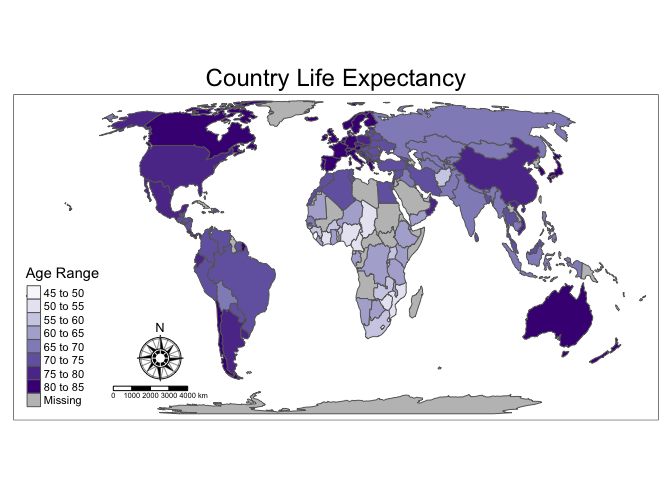

In the age of "Big Data", ESDA is a commonly used approach for exploring large datasets and looking for patterns before developing and testing hypotheses or ideas about the relationships of social and environmental variables.[^1]

>
**Today's lab has three goals:**

1. Learn to use R and RStudio for ESDA

2. Learn how to download and explore US Census data in R 

3. Learn to make a map in R

### 1. Install R & RStudio
**If R and RStudio are already installed on your computer, skip to Section 2**. If not, follow the instructions below.

#### 1.1. Download & Install R
R is a free and open source program that runs on many platforms (Mac, Windows, and Linux operating systems(OS)). To download R for your specific computer's OS, [visit this link](https://mirrors.nics.utk.edu/cran/). There are a couple of clicks involved to access the right file.

For Windows users, click the "Download R for Windows" link, then click the "install R for the first time" link.

For MacOS users, click the "Download R for (Mac) OS X" link, then download the "R-3.4.3.pkg" file.

If you have trouble installing R or RStudio, ask for help.

#### 1.2. Download & Install RStudio
RStudio improves the user experience with R. To download it for your OS, [visit this link](https://www.rstudio.com/products/rstudio/download/#download) and choose from one of the installers, not the Zip/Tarballs.

### 2. Install & Load R Packages
After R and RStudio are installed, open RStudio on your computer. Under file, you should open a new **script** file and then save it somewhere on your computer that you'll remember. This script window is where you'll type in the code from the lab exercises given below. Code is executed in the **console** window. You can either re-type the code directly into the console, or cut and paste from the script window. Alternatively, you can highlight code in the script window and (on Window), press Control+Enter to execute the highlighted code.

R uses **packages**, which are essentially "toolboxes" that consist of a set of **functions** for specific purposes. Functions have **arguments** that can be called.

For today's lab exercises, you first need to install the necessary R packages.

```r
install.packages(c("tidyverse", "sf", "tidycensus", "tigris", "tmap", "tmaptools"), 
                 repos = "https://mirrors.nics.utk.edu/cran/")
```

Then using the ```library()``` function, load the packages into the R environment.

```r
library(tidyverse)
library(sf)
library(tidycensus)
library(tigris)
library(tmap)
library(tmaptools)
```

### 3. Explore Census Data

#### 3.1. Obtain a Census API Key
Before your begin the lab exercises, you'll need to signup for your own US Census API (Application Programming Interface) Key. This allows you to download Census data through the R interface. You can [get your key here]( https://api.census.gov/data/key_signup.html). 

For Organization Name, put "St. Mary's College of Maryland" and for your email either use your [yourname]@smcm.edu or personal email address. After completing the form, you'll have to check your email to obtain your unique Census API Key.

After you receive the email containing your Census API Key insert it in the code below between the quotes and run the code to install it in your R environment.

```r
census_api_key("your_census_api_key_goes_here", install = TRUE)
```

Note that copying and pasting the code snippets is fine and can be very helpful, but it's a better idea for learning to type out the code manually each time. When you've really got the hang of it, then copying and pasting can save a lot of time! Try not to copy and paste the code for the remaining lab exercises.

#### 3.2. Download and plot Census data
Now that you have a Census API Key downladed and installed, you can move onto downloading census data. 

For accessing census data, the tidycensus package offers two main functions. One called get_decennial() accesses Decennial US Census data (collected every 10 years) for the years 1990, 2000, and 2010. The second function called get_acs() accesses American Community Survey (ACS) Census data, collected every year and averaged over 1, 3, and 5 years. 

Try downloading 5-year ACS data for the period 2012-2016 on median gross rent for all 50 US states plus Puerto Rico with the following.

```r
m16 <- get_acs(geography = "state", variables = "B25064_001E", year = 2016)
```

Note that the way R works is be allowing you to create new **objects** that appear in your Global Environment window. This window tells you how many observations (rows) and variables (columns) exist in an object. From the code above ```m16``` is the new object you just created. It is in the format of a **tibble**, which is a special kind of **dataframe** specific to the **tidyverse**. It now holds the data you downloaded on median gross rent. How many observations and variables does the ```m16``` dataframe have?

After downloading data, it's typically a good idea to make sure you accessed what you wanted. Often, the data are hundreds, if not thousands, of rows and many columns. To check the data, you can view the furst 10 rows by using the folloding function.

```r
head(m16)
```

```
## # A tibble: 6 x 5
##   GEOID NAME       variable   estimate   moe
##   <chr> <chr>      <chr>         <dbl> <dbl>
## 1 01    Alabama    B25064_001      728  4.00
## 2 02    Alaska     B25064_001     1173 11.0 
## 3 04    Arizona    B25064_001      937  4.00
## 4 05    Arkansas   B25064_001      689  4.00
## 5 06    California B25064_001     1297  2.00
## 6 08    Colorado   B25064_001     1057  4.00
```

A very population functionfor making plots (i.e., graphs) of data is called ```ggplot()```, which comes with the package ```ggplot2```. To plot the data on median gross rent in a graph, type in the code below.

```r
m16 %>%
  ggplot(aes(x = estimate, y = reorder(NAME, estimate))) + 
  geom_point()
```

<!-- -->

Your graph should look similar to the one above. Take a look at the plot and identify where Maryland was in 2016 compared to other states. Is median rent higher or lower than Virginia? If Maryland isn't your home state, how does the state where you went to high school compare to Maryland rent prices?

Let's explore a second variable, median household income. And this time, we'll give the plot a title, subtitle, and an x-axis label. The ACS data are not full census counts like the decennial data, but are instead based on an annual sample of approximately three million households. This means there's a margin of error associated with each estimate for ACS data. This downloads by default when accessing ACS data.

```r
## download 5-year ACS data on median household income for Maryland counties
md <- get_acs(geography = "county",
              variables = c(medincome = "B19013_001"),
              state = "MD")
```

Remember that you can check the data by using the function head().

```r
head(md)
```

Now plot the estimate with its respective margin of error (moe).


```r
md %>%
  mutate(NAME = gsub("County, Maryland", "", NAME)) %>%
  ggplot(aes(x = estimate, y = reorder(NAME, estimate))) + 
  geom_errorbarh(aes(xmin = estimate - moe, xmax = estimate + moe)) +
  geom_point(color = "red", size = 3) + 
  labs(title = "Median household income by county in Maryland",
       subtitle = "2012-2016 American Community Survey",
       y = "",
       x = "ACS estimate (bars represent margin of error)")
```

<!-- -->

#### 3.3. Explore other variables
There are thousands of variables collected with census data. What if you want to download and plot other variables? To explore the data, you need to download the variables as a table and filter through them until you find the variable code. Enter the following code to create a searchable table of ACS Census variables and then Decennial Census variables.


```r
## downloads ACS data for 2012-2016
acs16 <- load_variables(2016, "acs5", cache = TRUE)

## This function allows you to view the results similar to an Excel table.
## You can use the filter function to search for variable codes.
View(acs16)

## downloads 2010 Decennial census data
dec10 <- load_variables(2010, "sf1", cache = TRUE)

View(dec10)
```

Note that in the above code snippet, I've included comments. In R, you can add comments to your script with a leading #. I like using double hashtags, but that's not necessary. The number of hashtags doesn't effect how R interprets what follows it on that same line.

Before moving on to the next section of the lab, try searching the ```acs16``` and ```dec10``` variables that you just downloaded and selecting other variables of interest to download and plot. **Don't forget to give then new object names!**

### 4. Mapping with Census Data
Until recently, R hasn't been very user-friendly for mapping, but over the past year or two, tmap and other packages have been developed that have greatly improved the ease of mapmaking in R. For today's exercise, you'll learn the basics of the package called ```tmap``` ([more here](https://cran.r-project.org/web/packages/tmap/vignettes/tmap-nutshell.html)).

#### 4.1. Download Spatial Census Data
In this next step, you'll download the same data as above on median income, but also import its geometry; in other words, its spatial data.  


```r
## this sets the tigris data to cache so we don't have to download it each time
options(tigris_use_cache = TRUE)

md_spatial <- get_acs(geography = "county",
              variables = c(medincome = "B19013_001"),
              state = "MD", geometry = TRUE)

## view the data and compare to the head of the object md
head(md_spatial)
```

```
## Simple feature collection with 6 features and 5 fields
## geometry type:  MULTIPOLYGON
## dimension:      XY
## bbox:           xmin: -79.48765 ymin: 38.31653 xmax: -75.70736 ymax: 39.72288
## epsg (SRID):    4269
## proj4string:    +proj=longlat +datum=NAD83 +no_defs
##   GEOID                          NAME  variable estimate  moe
## 1 24003 Anne Arundel County, Maryland medincome    91918 1140
## 2 24009      Calvert County, Maryland medincome    96808 2924
## 3 24011     Caroline County, Maryland medincome    50830 1263
## 4 24023      Garrett County, Maryland medincome    46277 1567
## 5 24025      Harford County, Maryland medincome    81052 1488
## 6 24027       Howard County, Maryland medincome   113800 1574
##                         geometry
## 1 MULTIPOLYGON (((-76.84036 3...
## 2 MULTIPOLYGON (((-76.70121 3...
## 3 MULTIPOLYGON (((-76.01505 3...
## 4 MULTIPOLYGON (((-79.48765 3...
## 5 MULTIPOLYGON (((-76.0921 39...
## 6 MULTIPOLYGON (((-77.18711 3...
```

#### 4.2. Make a "Quick Thematic Map"
As part of the ```tmap``` package, the function ```qtm()``` is included. This stands for "quick thematic map", which allows you to put in ```spatial object``` such as the one you just created in the step above.

```r
qtm(md_spatial)
```

<!-- -->

The above map is a map of Maryland counties, but doesn't actually plot the data on median household income. Let's add some arguments to the ```qtm()``` function that will include those data in our map.

```r
qtm(md_spatial, fill = "estimate")
```

<!-- -->

The resulting map is a choropleth map with five categories for median household income. 

#### 4.3. Make a World Map
The ```tmap``` package comes with a few datasets included. You're going to load one of them into your Global Environment and explore it through the ```View()``` and ```head()``` functions you learned above. Then you'll map some of the data that it holds.

The data set you'll work with is called ```World``` and is a ```SpatialPolygonsDataFrame``` (SPDF for short), or what in GIS is commonly referred to as a **vector** format, as opposed to a **raster** format. 


```r
## Notice that the 'W' is capitalized here. Capitalization matters for most R functions, arguments, and objects
data(World)
```
Try viewing the data with the ```View()``` function.

The SPDF format is similar to the ```sf``` dataframe you downloaded above as ```md_spatial```, but comes with the data attached differently. It's more similar to the shapefile format, with different information held in different "subfiles". The **attribute** data for ```SPDF``` objects can be viewed using the ```head()``` function, but must be called specifically as in the code snippet below.

```r
## Now view just the attribute data
head(World@data)
```

```
##    iso_a3                 name           sovereignt     continent
## 2     AFG          Afghanistan          Afghanistan          Asia
## 3     AGO               Angola               Angola        Africa
## 5     ALB              Albania              Albania        Europe
## 8     ARE United Arab Emirates United Arab Emirates          Asia
## 9     ARG            Argentina            Argentina South America
## 10    ARM              Armenia              Armenia          Asia
##          subregion    area  pop_est pop_est_dens gdp_md_est gdp_cap_est
## 2    Southern Asia  652860 28400000     43.50090      22270    784.1549
## 3    Middle Africa 1246700 12799293     10.26654     110300   8617.6635
## 5  Southern Europe   27400  3639453    132.82675      21810   5992.6588
## 8     Western Asia   83600  4798491     57.39822     184300  38407.9078
## 9    South America 2736690 40913584     14.95003     573900  14027.1261
## 10    Western Asia   28470  2967004    104.21510      18770   6326.2469
##                      economy              income_grp life_exp well_being
## 2  7. Least developed region           5. Low income     48.7   4.758381
## 3  7. Least developed region  3. Upper middle income     51.1   4.206092
## 5       6. Developing region  4. Lower middle income     76.9   5.268937
## 8       6. Developing region 2. High income: nonOECD     76.5   7.196803
## 9    5. Emerging region: G20  3. Upper middle income     75.9   6.441067
## 10      6. Developing region  4. Lower middle income     74.2   4.367811
##         HPI
## 2  36.75366
## 3  33.20143
## 5  54.05118
## 8  31.77827
## 9  54.05504
## 10 46.00319
```

Now that you have the world data and have viewed its attribute dataframe, use the ```qtm()``` function to make a world map with the variable ```income_grp```. It should look like the one below. If you can't remember how to do that, look at the beginning of this section.
<!-- -->

#### 4.4. Best Practices for Cartography
Good mapmaking practices requrires that all maps have at minimum four peripheral features: (1) title, (2) legend, (3) north arrow, and (4) scale bar. Those haven't been included on the maps above, but they are easy to add with ```tmap``` functions. You can also move them around on the map with the ```position``` argument.

```r
tm_shape(World) + 
  tm_polygons("life_exp", 
              palette = "Purples",
              title = "Age Range") + 
  tm_compass(type = "rose", size = 3, position = c(0.18, 0.12)) +
  tm_scale_bar(width = 0.1, position = c(0.15, 0.05)) + 
  tm_layout(main.title = "Country Life Expectancy", main.title.position = "center")
```

<!-- -->

You'll notice that in the above code, I didn't use the ```qtm()``` function, but instead used ```tm_shape``` + ```tm_polygons```. The ```tmap``` package has several functions that are specific to spatial data in the format of polygons, points, lines, rasters, etc. This syntax also allows for stacking of layers of different formats, or layering spatial data. For example, we can layer GDP (Gross Domestic Product) per capita over our map of life expectancy.

```r
tm_shape(World) + 
  tm_polygons("life_exp", 
              palette = "Purples",
              title = "Age Range") + 
  tm_bubbles("gdp_cap_est", col = "red", title.size = "GDP Per Capita") +
  tm_compass(type = "rose", size = 3, position = c(0.18, 0.26)) +
  tm_scale_bar(width = 0.1, position = c(0.15, 0.19)) + 
  tm_layout(main.title = "Country Life Expectancy & GDP Per Capita", main.title.position = "center")
```

<!-- -->

##### 4.4.1. Map Projections
Using appropriate map projections are critical to good map making skills. Considerations must be made about inevitable distortions that will occur when projecting a sphere (the Earth) into 2-D space. Major considerations are shape, size, and scale. The default projection used by ```tmap``` for global projections is called Eckert IV. This is an equal-area projection that is psuedo-cylindrical. The function below is from the package ```tmaptools```.

```r
get_projection(World)
```

Without getting into more detail about what projections are most appropriate try using the skills you've learned and the code below to change the projection of the world map from above to be "Winkel Tripel" and then "Mercator". What do you notice about the "Mercator" projection? A list of projection values can be found [here](http://proj4.org/projections/index.html).

```r
qtm(World, fill = "life_exp", fill.title = "Age Range", projection = "eck4") + 
  tm_compass(type = "rose", size = 3, position = c(0.18, 0.12)) +
  tm_scale_bar(width = 0.1, position = c(0.15, 0.05)) + 
  tm_layout(main.title = "Country Life Expectancy", main.title.position = "center")
```


For all functions in R, it is possible to quickly call the "help" menu that shows all possible arguments that a function has, including the possible values for those arguments. For example, in the code snippet above you called for a rose-type compass, but there are many other values for that argument. To a functions arguments and associated values, type a ```?``` before the function.

```r
?tm_compass
```

### 5. Exporting Maps & Data
It is relatively easy to export a plot or map in R. In RStudio, you can use the "export" menu from the "Plots" tab. The following code will also export your map or plot as a TIFF image.

```r
## save the map as an object
map <- qtm(World, fill = "life_exp", fill.title = "Age Range"") + 
  tm_compass(type = "rose", size = 3, position = c(0.18, 0.12)) +
  tm_scale_bar(width = 0.1, position = c(0.15, 0.05)) + 
  tm_layout(main.title = "Country Life Expectancy", main.title.position = "center")

## export the map
tiff("map_of_life_exp.tif", height = 4, width = 6, units = "in", res = 300, compression = "lzw")
map
dev.off()
```

To find out where that export went to, you need to locate your **working directory**.

```r
getwd()
```

#### 5.1. Exporting to ESRI shapefiles
Sometimes, you may want to export your data into a **shapefile** format so you can view it in ArcGIS or QGIS. To do that is easy using the package called ```sf```, which stands for "simple features." 

The ```sf``` package is relatively new to R, but offers many features similar to those found in ArcGIS, such as spatial joins, unions, erasing, or clipping. Today's lab won't cover the ```sf``` package, but if you want to learn more about it, there are some great vignettes for it that can be found [here](https://cran.r-project.org/web/packages/sf/vignettes/sf1.html). 

```r
st_write(md_spatial, "md_spatial.shp")
```

To import shapefile data, use the ```st_read()``` function. Try importing a shapefile into R using this function and making a map with it using ```tmap```'s quick thematic map ```qtm()``` function.

***
### 6. More Resources for learning R and Mapping in R
R has a *huge* community of users and is growing rapidly. Below is a list of resources that I think are incredibly useful for learning the basics of R.

* [R for Data Science](http://r4ds.had.co.nz/index.html) is an incredibly useful resource for wrangling data; available online (for free) and in print.

* [Quick-R](https://www.statmethods.net/index.html) is another useful resource available online (for free) and in print.

* [Vignettes for ```tmap```](https://cran.r-project.org/web/packages/tmap/vignettes/tmap-nutshell.html)

* [Vignettes for ```sf```](https://cran.r-project.org/web/packages/sf/)

***
[^1]: Many of this lab's materials are sourced from Kyle Walker, the author of the [tidycensus R package](<https://walkerke.github.io/tidycensus/index.html>) and resources provided by the several authors of the [tmap R package](https://cran.r-project.org/package=tmap). Thanks to all of them for sharing.
